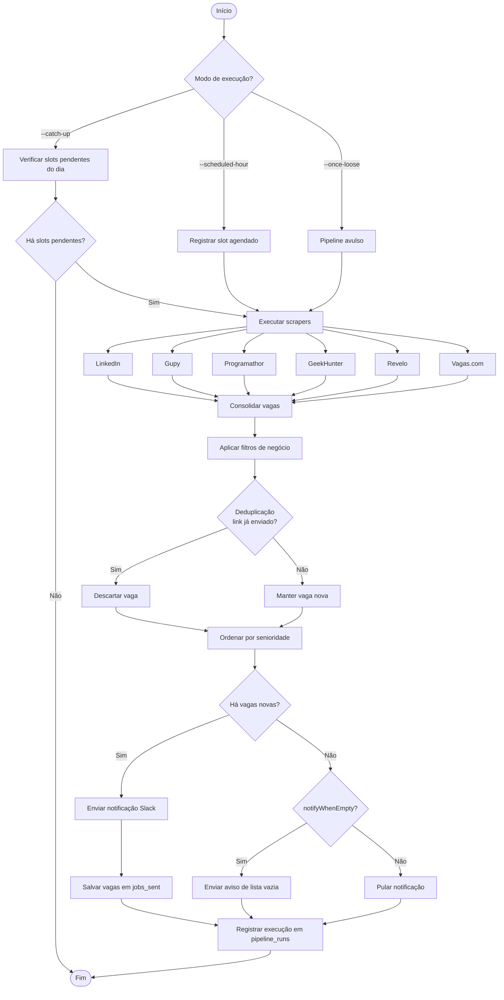
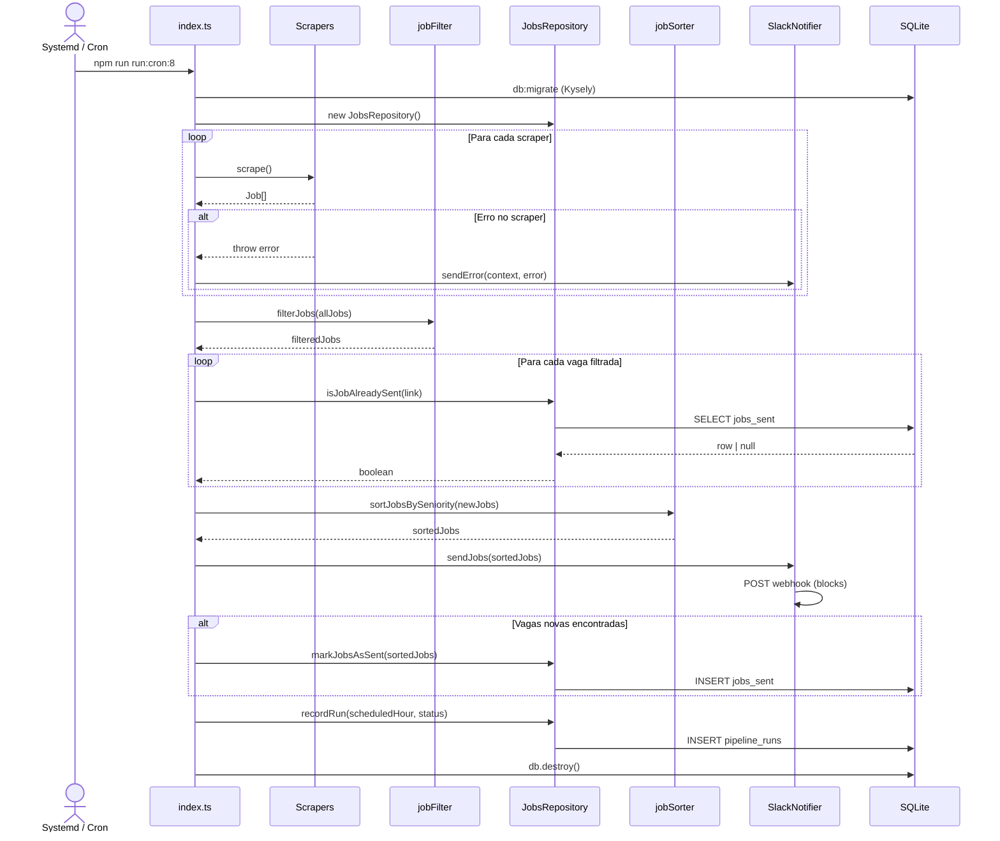

# Crawler Vagas Dev

Aplicação automatizada que coleta vagas de emprego em múltiplos portais de recrutamento, filtra oportunidades alinhadas ao perfil de **Desenvolvedor Frontend / React Native**, elimina duplicatas e envia apenas vagas novas para um canal no **Slack**.

O pipeline roda de forma agendada (3 vezes ao dia) ou sob demanda, com persistência local para controle de envios e rastreamento de execuções.

---

## Funcionalidades

- **Coleta multi-fonte** — Busca vagas em LinkedIn, Gupy, Programathor, Vagas.com, GeekHunter e Revelo em paralelo sequencial por scraper.
- **Filtragem inteligente** — Mantém apenas vagas de Frontend ou Mobile (React, Vue, Angular, React Native, iOS, Android).
- **Filtro de modalidade** — Aceita 100% remoto ou híbrido restrito a Campinas e Piracicaba.
- **Filtro de recência** — Descarta vagas publicadas há mais de 28 dias.
- **Deduplicação** — Evita reenvio de vagas já notificadas, usando o link como chave única no banco.
- **Ordenação por senioridade** — Prioriza Pleno, depois Sênior, Júnior e Não Informado nas notificações.
- **Notificações no Slack** — Envia mensagens formatadas com título, empresa, modelo de trabalho, senioridade, salário e contato.
- **Notificação de lista vazia** — Informa no Slack quando nenhuma vaga nova é encontrada (modo agendado).
- **Notificação de erros** — Envia alertas ao Slack quando um scraper ou o pipeline falha.
- **Agendamento automático** — Execuções às **08h, 13h e 20h** (horário de Brasília).
- **Catch-up no boot** — Ao reiniciar a máquina, executa slots pendentes do dia que ainda não rodaram.
- **Execução avulsa** — Modo `--once-loose` para rodar o pipeline manualmente sem aviso de lista vazia.
- **Migrações de banco** — Schema versionado com Kysely para tabelas de vagas enviadas e histórico de execuções.
- **Testes automatizados** — Cobertura de filtros, parsers, repositório, scrapers e notificador.

---

## Arquitetura

A aplicação segue uma **arquitetura em pipeline modular**, organizada em camadas com responsabilidades bem definidas:

```
src/
├── index.ts          # Orquestrador do pipeline e CLI
├── scrapers/         # Adaptadores por portal (Strategy Pattern)
├── filters/          # Regras de negócio para elegibilidade de vagas
├── sorters/          # Ordenação das vagas antes do envio
├── notifier/         # Integração com Slack
├── db/
│   ├── schema.ts     # Tipos do banco (Database, Insertable, Selectable)
│   ├── connection.ts # Instância Kysely + factory createDb()
│   ├── migrate.ts    # Runner de migrations (npm run db:migrate)
│   ├── JobsRepository.ts
│   └── migrations/   # Migrations versionadas do Kysely
├── utils/            # Parsers compartilhados (senioridade, modelo)
└── types/            # Contratos TypeScript (Job, Seniority, WorkModel)
```

### Princípios

| Camada | Responsabilidade |
|--------|------------------|
| **Scrapers** | Coletar vagas brutas de cada portal e normalizá-las para o tipo `Job` |
| **Filters** | Aplicar critérios de negócio (stack, localização, recência) |
| **Sorters** | Ordenar o resultado final para o usuário |
| **Repository** | Persistir vagas enviadas e registrar execuções do pipeline |
| **Notifier** | Comunicar resultados e erros via webhook do Slack |
| **Index (CLI)** | Orquestrar o fluxo, tratar falhas parciais e expor modos de execução |

Cada scraper implementa a interface `Scraper` com o método `scrape(): Promise<Job[]>`, permitindo adicionar ou remover fontes sem alterar o pipeline central. Falhas em um scraper isolado **não interrompem** os demais — o erro é logado e notificado no Slack.

O agendamento é feito externamente via **systemd timers** (preferencial) ou **cron**, mantendo a aplicação como um processo *oneshot* sem servidor HTTP embutido.

---

## Fluxograma da aplicação



---

## Diagrama de sequência



---

## Tecnologias e justificativas

| Tecnologia | Por que foi escolhida |
|------------|----------------------|
| **TypeScript** | Tipagem estática reduz erros em estruturas como `Job`, facilita refatoração e documenta contratos entre scrapers, filtros e repositório. |
| **Node.js (ES Modules)** | Ecossistema maduro para HTTP, parsing HTML e automação; módulos ESM alinham com padrões modernos do runtime. |
| **Axios** | Cliente HTTP confiável com suporte a headers customizados (User-Agent), necessário para scraping de páginas que bloqueiam bots. |
| **Cheerio** | Parser HTML server-side leve e rápido — ideal para extrair dados de páginas estáticas sem overhead de um browser headless. |
| **Kysely** | Query builder type-safe em TypeScript; o schema (`Database`) garante autocompletar e erros em tempo de compilação nas queries. |
| **better-sqlite3** | Driver SQLite síncrono e performático, integração nativa com o dialect do Kysely. |
| **dotenv** | Separa credenciais (Slack webhook, LinkedIn) do código-fonte, seguindo boas práticas de configuração por ambiente. |
| **Slack (Incoming Webhook)** | Canal de entrega imediato e familiar para o time; mensagens ricas com Block Kit melhoram a leitura das vagas. |
| **Jest + ts-jest** | Framework de testes consolidado no ecossistema Node/TS; cobertura integrada valida filtros, parsers e lógica de persistência. |
| **tsx** | Executa TypeScript diretamente sem build prévio, simplificando scripts de cron e desenvolvimento local. |
| **systemd timers / cron** | Agendamento delegado ao SO — a aplicação permanece stateless entre execuções, sem processo residente ou fila interna. |

> **Nota:** `puppeteer` aparece nas keywords do projeto como referência a scraping avançado, mas os scrapers atuais utilizam **Axios + Cheerio** (e API JSON no caso do Gupy) por serem mais leves. Portais com autenticação pesada (GeekHunter, Revelo) estão preparados como stubs para implementação futura.

---

## Pré-requisitos

- Node.js 20+
- npm

---

## Configuração

1. Clone o repositório e instale as dependências:

```bash
npm install
```

2. Copie o arquivo de ambiente e preencha as variáveis:

```bash
cp .env.example .env
```

| Variável | Descrição |
|----------|-----------|
| `SLACK_WEBHOOK_URL` | URL do Incoming Webhook do Slack |
| `LINKEDIN_USERNAME` | Usuário LinkedIn (reservado para scraping autenticado) |
| `LINKEDIN_PASSWORD` | Senha LinkedIn (reservado para scraping autenticado) |

3. Execute as migrações:

```bash
npm run db:migrate
```

---

## Uso

| Comando | Descrição |
|---------|-----------|
| `npm start` | Execução avulsa (`--once-loose`) |
| `npm run run:cron:8` | Pipeline do slot das 08h |
| `npm run run:cron:13` | Pipeline do slot das 13h |
| `npm run run:cron:20` | Pipeline do slot das 20h |
| `npm run run:cron:catch-up` | Executa slots pendentes do dia |
| `npm run cron:install` | Instala timers systemd (user) |
| `npm run db:migrate` | Aplica migrations do Kysely |
| `npm run db:rollback` | Reverte a última migration |
| `npm test` | Roda testes com cobertura |

### Agendamento

**Opção recomendada — systemd timers:**

```bash
npm run cron:install
loginctl enable-linger "$USER"   # permite timers sem sessão ativa
```

**Alternativa — crontab tradicional:** veja `scripts/crontab.example`.

---

## Estrutura do banco de dados

### `jobs_sent`

Registra vagas já notificadas para deduplicação.

| Coluna | Tipo | Descrição |
|--------|------|-----------|
| `id` | integer | PK |
| `link` | string | URL única da vaga |
| `title` | string | Título |
| `company` | string | Empresa |
| `sent_at` | timestamp | Data/hora do envio |

### `pipeline_runs`

Registra execuções agendadas por dia e slot horário (usado pelo catch-up).

| Coluna | Tipo | Descrição |
|--------|------|-----------|
| `id` | integer | PK |
| `run_date` | string | Data (YYYY-MM-DD, BRT) |
| `scheduled_hour` | integer | 8, 13 ou 20 (único por `run_date`) |
| `status` | string | `success` ou `error` |
| `ran_at` | timestamp | Momento da execução |

---

## Licença

ISC
