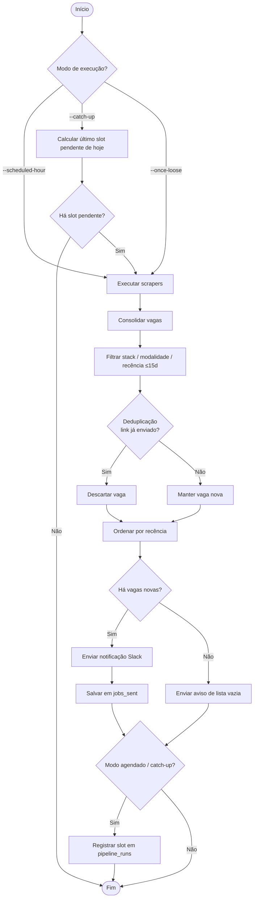
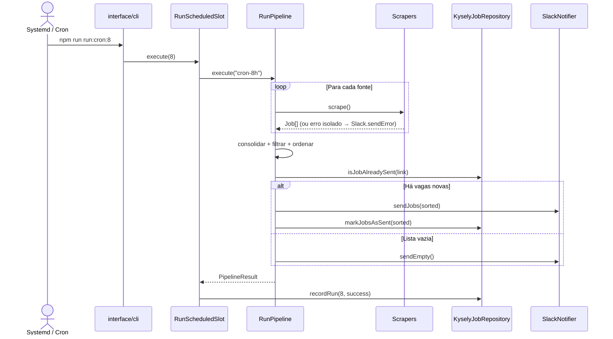

# Crawler Vagas Dev

Aplicação automatizada que coleta vagas de emprego em múltiplos portais de recrutamento, filtra oportunidades alinhadas ao perfil de **Desenvolvedor Frontend / React Native** (e ecossistema JavaScript ampliado), elimina duplicatas e envia apenas vagas novas para um canal no **Slack**.

O pipeline roda de forma agendada (3 vezes ao dia) ou sob demanda, com persistência local para controle de envios e rastreamento de execuções.

---

## Funcionalidades

- **Coleta multi-fonte** — Busca vagas em paralelo sequencial por fonte:
  - **11 repositórios `*/vagas` do GitHub** (frontendbr, react-brasil, flutterbr, nodejsdevbr, rustdevbr, gommunity, pydevbr, phpdevbr, rubydevbr, frontend-ao, frontend-pt) via API REST de issues.
  - **Portais server-rendered**: APInfo, Vagas.com, Programathor e a API do Gupy.
  - **Portais SPA** (via Playwright): Sólides Vagas, Workana, Coodesh, Trampos.co.
  - **Quickin (ATS)** — boards de vagas de empresas hospedados no Quickin, configuráveis por slug (ex.: `avanttibr`).
  - **LinkedIn** — busca pública de vagas (sem login).
  - **Indeed** — busca de "desenvolvedor" (últimos 14 dias, remoto) via navegador headless (contorna o Cloudflare); fecha o popup de e-mail por fallback e descarta vagas de torno CNC / mecânica.
  - Stubs preparados (GeekHunter, Revelo).
- **Paginação** — Cada fonte trata paginação/scroll para coleta completa, parando ao ultrapassar a janela de recência.
- **Filtragem inteligente** — Mantém vagas de Frontend/Mobile **e** do ecossistema JavaScript ampliado (Node, Node-RED, Electron, Elixir, Backbone, TypeScript e afins).
- **Filtro de modalidade** — Aceita 100% remoto ou híbrido restrito a Campinas e Piracicaba.
- **Filtro de recência** — Descarta vagas publicadas há mais de **15 dias**.
- **Ordenação por recência** — Exibe da vaga **mais recente para a menos recente** (senioridade como desempate).
- **Deduplicação** — Evita reenvio de vagas já notificadas, usando o link como chave única no banco.
- **Notificações no Slack** — Mensagens formatadas com título, empresa, modelo, senioridade, data de publicação, salário, contato e fonte.
- **Notificação de lista vazia** — Avisa no Slack quando nenhuma vaga nova é encontrada (**em todos os modos**, incluindo execução avulsa).
- **Notificação de erros** — Alertas ao Slack quando um scraper ou o pipeline falha (falha de uma fonte não interrompe as demais).
- **Agendamento automático** — Execuções às **08h, 13h e 20h** (horário de Brasília).
- **Catch-up no boot** — Ao reiniciar a máquina, executa **apenas o último slot pendente do dia atual**.
- **Migrações de banco** — Schema versionado com Kysely.
- **Testes automatizados** — Cobertura de domínio, casos de uso, parsers, repositório, scrapers e notificador.

---

## Arquitetura

A aplicação segue **Clean Architecture**, com dependências apontando sempre para o domínio:

```
src/
├── domain/                       # Regras puras, sem dependências externas
│   ├── entities/Job.ts           # Job, WorkModel, Seniority
│   ├── services/                 # JobEligibility, JobOrdering, Schedule
│   └── ports/                    # Interfaces: SourceScraper, JobRepository, Notifier, Clock
├── application/
│   └── usecases/                 # RunPipeline, RunScheduledSlot, CatchUp, RunOnce
├── infrastructure/               # Implementações concretas (adapters)
│   ├── http/                     # HttpClient (axios) + BrowserClient (Playwright, opcional)
│   ├── scrapers/                 # Adapters por fonte + registry + GithubVagasScraper genérico
│   ├── persistence/              # Kysely: connection, schema, migrations, KyselyJobRepository
│   └── notifier/                 # SlackNotifier
└── interface/
    └── cli/index.ts              # Composition root: injeta adapters nos casos de uso
```

### Princípios


| Camada             | Responsabilidade                                                                                      |
| ------------------ | ----------------------------------------------------------------------------------------------------- |
| **domain**         | Entidades e regras de negócio puras (elegibilidade, ordenação, agendamento) e os *ports* (interfaces) |
| **application**    | Casos de uso que orquestram os ports, sem conhecer detalhes de infraestrutura                         |
| **infrastructure** | Adapters concretos: scrapers, persistência (Kysely), Slack, HTTP/Playwright                           |
| **interface**      | CLI — *composition root* que instancia adapters e injeta nos casos de uso                             |


Cada fonte implementa a interface `SourceScraper` (`name` + `scrape(): Promise<Job[]>`), permitindo adicionar ou remover fontes sem alterar o pipeline central. Falhas em uma fonte isolada **não interrompem** as demais — o erro é logado e notificado no Slack.

O agendamento é feito externamente via **systemd timers** (preferencial) ou **cron**, mantendo a aplicação como um processo *oneshot* sem servidor HTTP embutido.

---

## Fluxograma da aplicação




> O **registro do slot** (`pipeline_runs`) ocorre **somente após a consolidação das vagas**, garantindo que o slot só conste como executado quando a raspagem de fato aconteceu.

---

## Diagrama de sequência




---

## Tecnologias e justificativas


| Tecnologia                   | Por que foi escolhida                                                                                 |
| ---------------------------- | ----------------------------------------------------------------------------------------------------- |
| **TypeScript**               | Tipagem estática nos contratos entre camadas (entidades, ports, adapters).                            |
| **Node.js (ES Modules)**     | Ecossistema maduro para HTTP, parsing HTML e automação.                                               |
| **Axios**                    | Cliente HTTP com headers customizados e suporte a `arraybuffer` (decodificação ISO-8859-1 do APInfo). |
| **Cheerio**                  | Parser HTML server-side leve para portais estáticos.                                                  |
| **Playwright**               | Navegador headless para renderizar fontes SPA; importado dinamicamente e com degradação graciosa.     |
| **Kysely + better-sqlite3**  | Query builder type-safe sobre SQLite síncrono.                                                        |
| **dotenv**                   | Configuração por ambiente (Slack webhook, GitHub token).                                              |
| **Slack (Incoming Webhook)** | Entrega imediata com Block Kit.                                                                       |
| **Jest + ts-jest**           | Testes com cobertura do núcleo (domínio, casos de uso, parsers, repositório, scrapers).               |
| **tsx**                      | Executa TypeScript direto, sem build prévio.                                                          |
| **systemd timers / cron**    | Agendamento delegado ao SO; aplicação stateless entre execuções.                                      |


> **Nota sobre fontes SPA:** Sólides, Workana, Coodesh e Trampos.co renderizam as vagas no cliente e são coletadas via Playwright (verificadas com vagas reais). Cada uma degrada para lista vazia sem quebrar o pipeline caso a renderização falhe. O Chromium é instalado com `npx playwright install chromium`.

---

## Pré-requisitos

- Node.js 20+
- npm

---

## Configuração

1. Instale as dependências:

```bash
npm install
```

1. Copie o arquivo de ambiente e preencha as variáveis:

```bash
cp .env.example .env
```


| Variável            | Descrição                                                                                                          |
| ------------------- | ------------------------------------------------------------------------------------------------------------------ |
| `SLACK_WEBHOOK_URL` | URL do Incoming Webhook do Slack                                                                                   |
| `GITHUB_TOKEN`      | *(Opcional)* eleva o limite da API do GitHub de 60 para 5000 req/h                                                 |
| `QUICKIN_COMPANIES` | *(Opcional)* empresas no Quickin a coletar (slugs separados por vírgula); sem isto, usa a lista padrão de empresas |


1. Execute as migrações:

```bash
npm run db:migrate
```

---

## Uso


| Comando                     | Descrição                             |
| --------------------------- | ------------------------------------- |
| `npm start`                 | Execução avulsa (`--once-loose`)      |
| `npm run run:cron:8`        | Pipeline do slot das 08h              |
| `npm run run:cron:13`       | Pipeline do slot das 13h              |
| `npm run run:cron:20`       | Pipeline do slot das 20h              |
| `npm run run:cron:catch-up` | Executa o último slot pendente do dia |
| `npm run cron:install`      | Instala timers systemd (user)         |
| `npm run db:migrate`        | Aplica migrations do Kysely           |
| `npm run db:rollback`       | Reverte a última migration            |
| `npm test`                  | Roda testes com cobertura             |


### Agendamento

**Opção recomendada — systemd timers:**

```bash
npm run cron:install
loginctl enable-linger "$USER"   # permite timers sem sessão ativa
```

**Alternativa — crontab tradicional:** veja `scripts/crontab.example`.

---

## Estrutura do banco de dados

### `jobs_sent`

Registra vagas já notificadas para deduplicação.


| Coluna         | Tipo      | Descrição                                 |
| -------------- | --------- | ----------------------------------------- |
| `id`           | integer   | PK                                        |
| `link`         | string    | URL única da vaga                         |
| `title`        | string    | Título                                    |
| `company`      | string    | Empresa                                   |
| `source`       | string    | Fonte de origem (portal/repo)             |
| `published_at` | string    | Data de publicação (ISO) quando conhecida |
| `sent_at`      | timestamp | Data/hora do envio                        |


### `pipeline_runs`

Registra execuções agendadas por dia e slot horário (usado pelo catch-up).


| Coluna           | Tipo      | Descrição                          |
| ---------------- | --------- | ---------------------------------- |
| `id`             | integer   | PK                                 |
| `run_date`       | string    | Data (YYYY-MM-DD, BRT)             |
| `scheduled_hour` | integer   | 8, 13 ou 20 (único por `run_date`) |
| `status`         | string    | `success` ou `error`               |
| `ran_at`         | timestamp | Momento da execução                |


---

## Licença

ISC